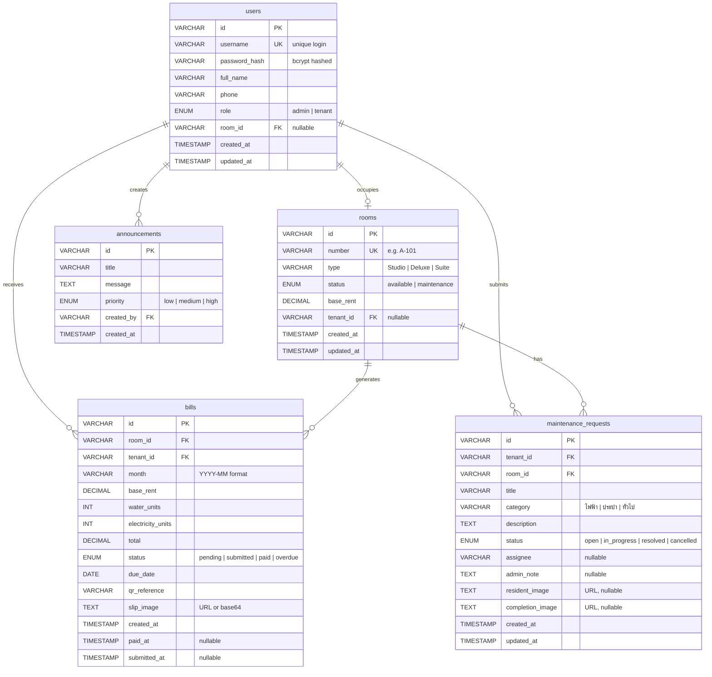

# Smart Dorm — Database Design

## ER Diagram



---

## Table Definitions (SQL)

### 1. `users`

| Column | Type | Constraint | Description |
|---|---|---|---|
| `id` | VARCHAR(36) | PRIMARY KEY | UUID |
| `username` | VARCHAR(50) | UNIQUE, NOT NULL | Login username |
| `password_hash` | VARCHAR(255) | NOT NULL | Bcrypt hashed password |
| `full_name` | VARCHAR(100) | NOT NULL | ชื่อ-นามสกุล |
| `phone` | VARCHAR(20) | | เบอร์โทรศัพท์ |
| `role` | ENUM('admin','tenant') | NOT NULL | บทบาท |
| `room_id` | VARCHAR(36) | FK → rooms.id, NULLABLE | ห้องที่พักอาศัย |
| `created_at` | TIMESTAMP | DEFAULT NOW() | |
| `updated_at` | TIMESTAMP | ON UPDATE NOW() | |

---

### 2. `rooms`

| Column | Type | Constraint | Description |
|---|---|---|---|
| `id` | VARCHAR(36) | PRIMARY KEY | UUID |
| `number` | VARCHAR(20) | UNIQUE, NOT NULL | เลขห้อง e.g. A-101 |
| `type` | VARCHAR(30) | NOT NULL | Studio / Deluxe / Suite |
| `status` | ENUM('available','maintenance') | DEFAULT 'available' | สถานะห้อง |
| `base_rent` | DECIMAL(10,2) | NOT NULL | ค่าเช่าพื้นฐาน |
| `tenant_id` | VARCHAR(36) | FK → users.id, NULLABLE | ผู้เช่าปัจจุบัน |
| `created_at` | TIMESTAMP | DEFAULT NOW() | |
| `updated_at` | TIMESTAMP | ON UPDATE NOW() | |

---

### 3. `bills`

| Column | Type | Constraint | Description |
|---|---|---|---|
| `id` | VARCHAR(36) | PRIMARY KEY | UUID |
| `room_id` | VARCHAR(36) | FK → rooms.id, NOT NULL | ห้องที่ออกบิล |
| `tenant_id` | VARCHAR(36) | FK → users.id, NOT NULL | ผู้เช่าที่รับบิล |
| `month` | VARCHAR(7) | NOT NULL | เดือนบิล (YYYY-MM) |
| `base_rent` | DECIMAL(10,2) | NOT NULL | ค่าเช่าพื้นฐาน |
| `water_units` | INT | DEFAULT 0 | หน่วยน้ำ |
| `electricity_units` | INT | DEFAULT 0 | หน่วยไฟ |
| `total` | DECIMAL(10,2) | NOT NULL | ยอดรวม |
| `status` | ENUM('pending','submitted','paid','overdue') | DEFAULT 'pending' | สถานะ |
| `due_date` | DATE | NOT NULL | วันครบกำหนดชำระ |
| `qr_reference` | VARCHAR(50) | | QR reference code |
| `slip_image` | TEXT | NULLABLE | URL สลิปโอนเงิน |
| `created_at` | TIMESTAMP | DEFAULT NOW() | |
| `paid_at` | TIMESTAMP | NULLABLE | วันที่ยืนยันชำระ |
| `submitted_at` | TIMESTAMP | NULLABLE | วันที่ส่งสลิป |

> **Unique constraint:** [(room_id, month)](file:///c:/Users/Clumsyz/Downloads/Smart_Dorm_windsurf/src/app/core.ts#54-57) — ห้องหนึ่งมีได้แค่ 1 บิลต่อเดือน

---

### 4. `maintenance_requests`

| Column | Type | Constraint | Description |
|---|---|---|---|
| `id` | VARCHAR(36) | PRIMARY KEY | UUID |
| `tenant_id` | VARCHAR(36) | FK → users.id, NOT NULL | ผู้แจ้ง |
| `room_id` | VARCHAR(36) | FK → rooms.id, NOT NULL | ห้องที่แจ้ง |
| `title` | VARCHAR(100) | NOT NULL | หัวข้อ |
| `category` | VARCHAR(30) | NOT NULL | หมวดหมู่ |
| `description` | TEXT | | รายละเอียด |
| `status` | ENUM('open','in_progress','resolved','cancelled') | DEFAULT 'open' | สถานะ |
| `assignee` | VARCHAR(100) | NULLABLE | ผู้รับมอบหมาย |
| `admin_note` | TEXT | NULLABLE | หมายเหตุจาก Admin |
| `resident_image` | TEXT | NULLABLE | รูปจากผู้แจ้ง |
| `completion_image` | TEXT | NULLABLE | รูปยืนยันเสร็จ |
| `created_at` | TIMESTAMP | DEFAULT NOW() | |
| `updated_at` | TIMESTAMP | ON UPDATE NOW() | |

---

### 5. `announcements`

| Column | Type | Constraint | Description |
|---|---|---|---|
| `id` | VARCHAR(36) | PRIMARY KEY | UUID |
| `title` | VARCHAR(150) | NOT NULL | หัวข้อ |
| `message` | TEXT | NOT NULL | เนื้อหาประกาศ |
| `priority` | ENUM('low','medium','high') | DEFAULT 'low' | ระดับความสำคัญ |
| `created_by` | VARCHAR(36) | FK → users.id, NOT NULL | ผู้สร้าง (Admin) |
| `created_at` | TIMESTAMP | DEFAULT NOW() | |

---

## Relationships Summary

```
users 1 ──── 0..1 rooms        (ผู้เช่าพักห้องเดียว)
rooms 1 ──── 0..* bills        (ห้องหนึ่งมีหลายบิล)
users 1 ──── 0..* bills        (ผู้เช่าได้รับหลายบิล)
users 1 ──── 0..* maintenance  (ผู้เช่าแจ้งซ่อมหลายรายการ)
rooms 1 ──── 0..* maintenance  (ห้องมีหลายงานซ่อม)
users 1 ──── 0..* announcements (Admin สร้างหลายประกาศ)
```

---

## Indexes ที่แนะนำ

| Table | Index | Columns | Purpose |
|---|---|---|---|
| `users` | `idx_users_username` | `username` | Login lookup |
| `users` | `idx_users_role` | `role` | กรอง admin/tenant |
| `rooms` | `idx_rooms_tenant` | `tenant_id` | หาห้องของผู้เช่า |
| `bills` | `idx_bills_tenant_month` | `tenant_id, month` | ดึงบิลตามผู้เช่า+เดือน |
| `bills` | `idx_bills_status` | `status` | กรองบิลค้างชำระ |
| `maintenance_requests` | `idx_maint_tenant` | `tenant_id` | งานซ่อมของผู้เช่า |
| `maintenance_requests` | `idx_maint_status` | `status` | กรองสถานะงาน |
| `announcements` | `idx_ann_created` | `created_at DESC` | เรียงข่าวล่าสุด |

---

## Notes

- **Password**: ตอนนี้ใน [core.ts](file:///c:/Users/Clumsyz/Downloads/Smart_Dorm_windsurf/src/app/core.ts) เก็บ password เป็น plaintext — ในฐานข้อมูลจริงต้องใช้ **bcrypt** หรือ **argon2** hash เสมอ
- **Images**: แนะนำเก็บเป็น URL ที่ชี้ไปยัง Object Storage (เช่น S3, Supabase Storage) แทนการเก็บ base64 ในฐานข้อมูลตรงๆ
- **Soft Delete**: อาจเพิ่มคอลัมน์ `deleted_at TIMESTAMP NULLABLE` ในทุกตารางหากต้องการลบแบบ Soft Delete
